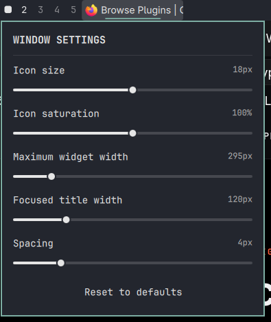
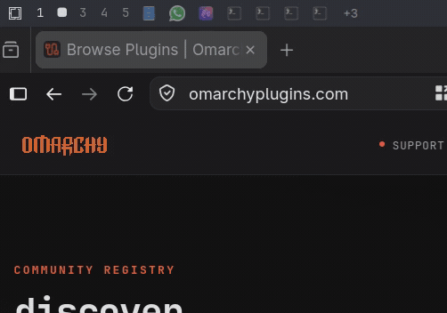

# Yet Another Active Window

Yet another active window indicator for the Omarchy bar — because apparently
the bar needed one more. This one behaves like a row of browser tabs: windows
appear where they first opened, stay there, and only the focused tab grows a
title. Lightweight, native Quickshell/QML, no daemons, no polling.

> Browser-tab-style window management for the Omarchy bar.

## Preview


### Settings



### Interactive overflow




## Features

### Window management

- Shows **multiple windows** — not just the active one — as compact tab-like
  entries.
- Only windows on the **active workspace of the monitor the bar lives on**
  are shown; each per-monitor bar instance shows its own set.
- **Stable, browser-tab-like ordering**: windows appear where they first
  appeared and stay there.
- Newly opened windows **append at the end**.
- Focus changes **never reorder** entries.
- Closed windows simply disappear; remaining entries keep their relative
  order.
- The **focused window remains visible** even when `+N` overflow is active —
  it swaps into the last visible slot instead of hiding or jumping to the
  front.

### Active window

- Real application icon plus a formatted title:
  `<window title> – <application name>`.
- The application name is appended only when it adds information; if the
  title already contains it, the title is shown unchanged — never
  "Firefox – Mozilla Firefox".
- If the formatted title overflows its allocated space, an automatic marquee
  starts: pause briefly → smoothly scroll left → pause briefly at the end →
  reset → repeat. Titles that fit never scroll; hovering pauses the scroll.
- The active window **never shows a hover tooltip**: its visible title or
  marquee already carries that information.

### Inactive windows

- Inactive windows are icon-only to keep the bar compact.
- Hovering an inactive entry shows a lightweight **text window preview**: a
  standard Omarchy tooltip with the same formatted window/application title
  used for the active entry.
- This is explicitly **not** a screenshot, thumbnail, or live graphical
  preview — just text computed from data the widget already has.

### Icons

- Generic desktop-entry resolution over the window identity
  (`appId` / `class` / `initialClass`) through the shell's shared AppLibrary,
  including desktop-entry id, `StartupWMClass`, and heuristic matching.
- Generic **Omarchy/Chromium web-app matching**: URL hosts embedded in a
  launcher's command line are matched against host segments Chromium embeds
  in the window class — apps like WhatsApp and HEY resolve generically.
- A conservative PID → `/proc/<pid>/exe` fallback exists for difficult
  unresolved identities.
- Resolved matches are cached per window identity; ambiguous or unknown
  applications fall back safely to a neutral placeholder glyph rather than
  showing an incorrect icon. There are no hard-coded app-specific fixes.
  Firefox and Foot are runtime-tested examples of plain desktop-entry
  resolution; generic resolution with safe fallback is the goal, not a
  guarantee that literally every application resolves.

### Overflow

When all windows cannot fit within the configured maximum width, the widget
shows an adaptive `+N` indicator representing the currently hidden windows:

- **Left click `+N`** opens a lightweight native overflow popup listing only
  the windows hidden right now, each with its existing resolved application
  icon and formatted title.
- **Left click a hidden entry** focuses that window and closes the popup.
- **Middle click a hidden entry** closes that window; the list updates
  reactively while the popup stays open.
- **Right click `+N`** continues to open visual settings, as everywhere else.
- Opening or focusing a hidden window does **not** permanently reorder the
  stable browser-tab order — if the focused window was hidden, it temporarily
  appears in the last visible slot and can never appear twice in the popup.
- The popup is lazy and lightweight: it is just another view of window data
  the widget already knows. No polling, daemon, screenshot capture, or extra
  icon resolver is involved, and it closes automatically if nothing remains
  hidden.

The focused window is always kept visible even under overflow, swapping into
the last visible slot instead of jumping to the front.

### Interactions

See the [interaction table](#interactions) below — every clickable surface
uses a consistent pointing-hand cursor.

### Visual settings

All five visual settings are editable live from the right-click popup and
persist natively. See [Settings](#settings).

### Performance

Deliberately low-resource by design — see
[Performance](#performance) for what this plugin refuses to do.

## Settings

| Setting | Default | Range | Description |
|---|---|---|---|
| Icon size | 18 px | 12–24 px | Pixel size of application icons inside entries |
| Icon saturation | 100 % | 0–200 % | `0 %` grayscale, `100 %` original, `200 %` oversaturated |
| Maximum widget width | 480 px | 160–1000 px | Hard cap for the whole window list |
| Focused-title width | 120 px | 40–400 px | Maximum title space for the focused entry |
| Spacing | 4 px | 2–12 px | Gap between entries |

Sliders are draft-based: while dragging, only the numeric value updates; the
actual change **commits when the slider is released**, so dragging never
triggers expensive full-bar recomputation. Each release performs exactly one
persistence write through Omarchy's native inline shell.json settings.
**Reset to defaults** restores all five settings together in a single
operation.

## Interactions

| Action | Result |
|---|---|
| Left click window | Focus that window |
| Middle click window | Close that window |
| Right click window | Open visual settings |
| Hover inactive window | Text window preview tooltip |
| Hover active window | No tooltip (title/marquee already shown) |
| Left click `+N` | Toggle the hidden-windows overflow popup |
| Middle click hidden overflow entry | Close that window (list updates reactively) |
| Right click `+N` | Open visual settings |

Clicking anywhere outside the settings or overflow popup dismisses it.

## Performance

This plugin deliberately avoids:

- window polling
- daemons
- runtime `hyprctl` calls
- screenshot previews or any background capture
- per-window subprocesses

Everything reacts through Hyprland's models via QML bindings. Positive icon
matches are cached per window identity, so normal warm operation spawns no
subprocesses. Exactly **one shared process** exists, used only as an
exceptional fallback to read `/proc/<pid>/exe` when no desktop-entry metadata
explains a window identity. The saturation effect layer is disabled entirely
at 100 % saturation, so the default configuration pays nothing for it.
Commit-on-release settings avoid delegate recreation, image redecoding,
effect churn, and whole-bar relayout during slider movement.

## Installation

Yet Another Active Window is currently a local Omarchy plugin. Place the
repository folder under `~/.config/omarchy/plugins/` and reference it from
your shell configuration's bar layout, e.g.:

```json
{ "id": "ncc.yet-another-active-window" }
```

## Validation / Development

```sh
omarchy plugin validate .
/usr/lib/qt6/bin/qmllint \
  -I /usr/lib/qt6/qml \
  -I /usr/share/omarchy/shell \
  BarWidget.qml
```

Note: `qmllint` may emit warnings about unresolved `qs.*` modules when run
outside the shell environment (missing tooling metadata for Omarchy/Quickshell
types). These are environmental and do not indicate runtime problems;
`omarchy plugin validate` and actual runtime behavior are authoritative.

## Inspiration and attribution

Yet Another Active Window studied
[crmne/omarchy-active-window](https://github.com/crmne/omarchy-active-window)
by Carmine Paolino as an important functional/reference source during design.
It informed ideas and patterns around:

- desktop-entry/icon resolution
- StartupWMClass matching
- executable fallback concepts
- icon saturation
- icon sizing
- title width handling
- Omarchy inline settings

This plugin is an independent implementation that goes substantially further:

- multiple windows instead of a single active-window pill
- monitor/workspace filtering per bar instance
- stable browser-tab ordering with append behavior
- adaptive `+N` overflow with an interactive hidden-window popup
- marquee scrolling for overflowing titles
- inactive text window previews
- generic Omarchy/Chromium web-app matching
- a shared batched PID fallback process
- native full-entry click-target integration for cursor reliability
- commit-on-release settings performance
- reset-to-defaults

No source code was copied; thank you, Carmine, for the excellent reference
(MIT licensed).

## License

Yet Another Active Window is released under the MIT License — see
[LICENSE](LICENSE). Copyright belongs to ncc.

Third-party situation: omarchy-active-window inspired ideas and patterns but
no source code from it is included in this repository, so no third-party
notice file is required; its MIT license is acknowledged in the attribution
above.
